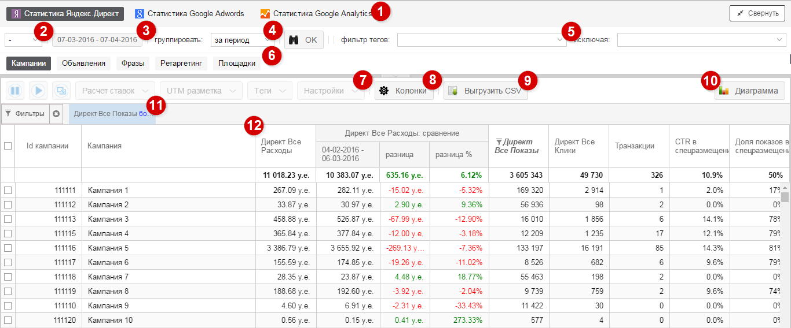

#Статистика

Сервис, позовляющий работать с данными из **рекламных систем** (Яндекс.Директ, Google AdWords)и **внешних источников данных** (Google Analytics, Calltracking системы, CRM), а также применять определенные действия на основе этих данных.

Интерфейс статистики можно разбить на отдельные блоки, каждый из которых отвечает за определённый функционал

##
1

Выбор сервиса

##
2

Полнокранный режим

##
3

Валюта в отчетах

##
4

Выбор пероида

##
5

Группировка данных

##
6

Фильтр тегов

##
7

Выбор отчета

##
8

Кнопки действия

##
9

Колонки

##
10

Выгрузка в CSV

##
11

Диаграмма

##
12

Фильтры

##
13

Параметры колонки

