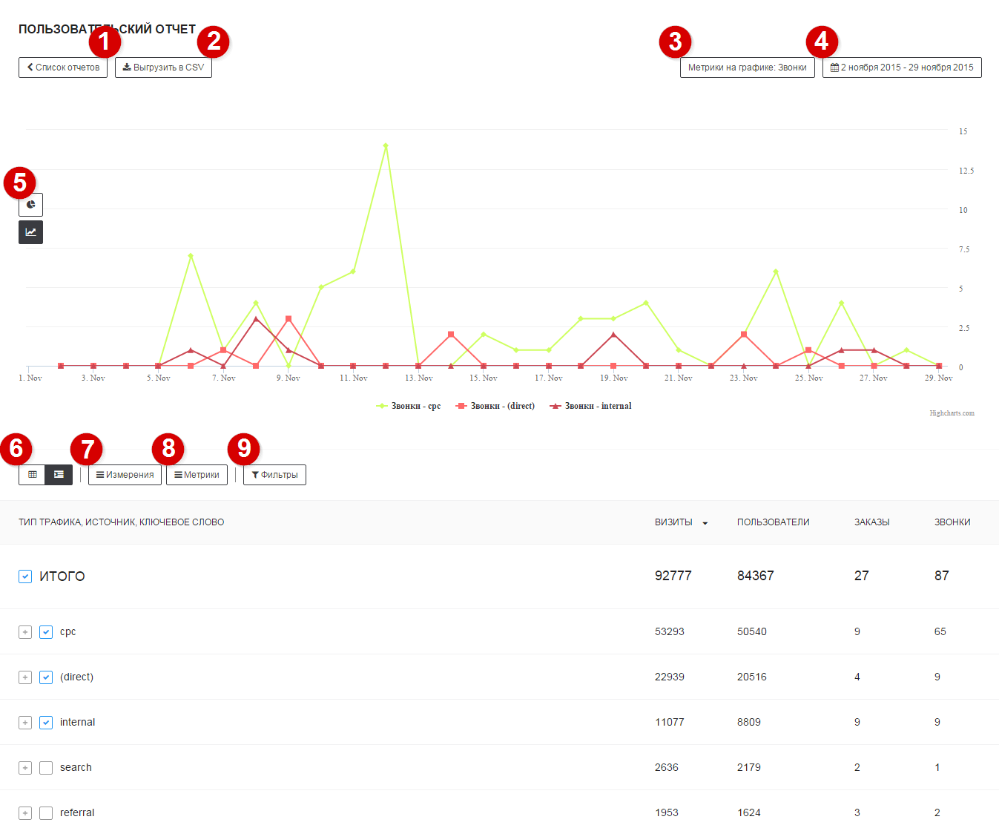
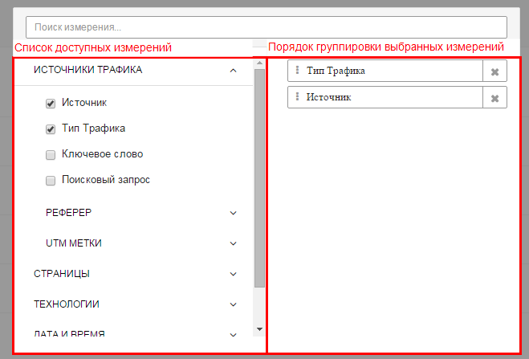
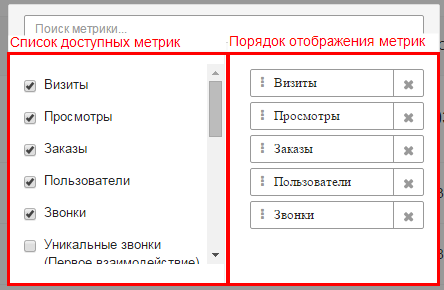

service: tracker
service_name: K☆50:Трекер

#Отчеты

Отчеты предоставляют статистическую информацию о сайте и обращениях посетителей.
Каждый отчет содержит показатели, объединенные в группы (например, по типу трафика). Отчет строится за определенный период времени. По умолчанию он соответствует месяцу. Данные отображаются в таблице и на диаграмме.

##Настройка отчета

Ниже описаны инструменты, с помощью которых вы можете настроить вид отчета:

##
1

Список отчетов

Открывает список готовых отчетов. Данные отчеты рекомендуется использовать в качестве примера для создания собственных.

##
2

Выгрузка CSV

Позволяет выгружать отчет в формате CSV.
В выгрузке будут предоставлены данные:
- по указанным измерениям, метрикам 
- за выбранный период 
- с учетом активных фильтров.

##
3

Метрики на диаграмме

Позволяет выбрать метрики, которые будут отображаться на диаграмме. Выбрать можно только добавленные в отчет метрики.  

Круговая диаграмма отображает данные для 1 метрики. Линейная диаграмма позволяет отображать данные сразу для нескольких метрик.

##
4

Период отчета

Вы можете выбрать календарный период времени, за который будет построен отчет. По умолчанию отображаются данные за месяц. Доступны стандартные диапазоны дат, также можно выбрать собственный диапазон.

##
5

Виды диаграмм

Позволяет выбрать диагарамму, подходящую для конкретной задачи. В данный момент доступны следующие виды диаграмм:

**Линейная** 
Показывает изменения абсолютных значений измеряемых величин во времени.

**Круговая** 
Показывает распределение величин по группам.

##
6

Формат отчета

Позволяет выбрать формат отображения данных. В данный момент доступны следующие форматы:

**Древовидный список** 

Данные группируются **последовательно** по каждому выбранному измерению, формируя древовидную структуру.

**Линейный список** 
Данные группируются **одновременно** по всем выбранным измерениям, формируя линейную структуру.

##
7

Измерения

Позволяет выбрать измерения, по которым будут группироваться метрики. Для выбранных измерений можно задать порядок группировки.

**Порядок группировки данных**

Для одинакового набора измерений отображение данных будет отличаться в зависимости от последовательности группировки метрик. Ниже приведен пример отчета, сгруппированого по измерениям **Тип трафика**, **Источник**

**Отображение на диаграмме**

Трекер позволяет отображать любой срез данных на диаграмме. Для отображения среза необоходимо кликнуть по полю слева от него:

В зависимости от выбранных сегментов поле может выглядеть следующим образом:
 - сегмент не отображается на графике
 - сегмент отображается на графике
 - вложенный сегмент отображается на графике

##
8

Метрики

Позволяет выбрать метрики, которые будут отображаться в отчете. Для выбранных метрик можно задать порядок отображения в отчете.

**Сортировка данных**

Вы можете сортировать данные по определенной метрике. Для этого необходимо кликнуть в отчете на её название.

Сортировка будет осуществляться для каждой группировки в соответствии с их порядком.

##
9

Фильтры

Фильтры позволяют работать с данными, удовлетворяющими определенным условиям.
Условия могут применяться на метрики и измерения, выбранные в отчете (подробнее ниже).

Используемые фильтры отображаются в отдельной панели, из которой их можно оперативно убрать.

